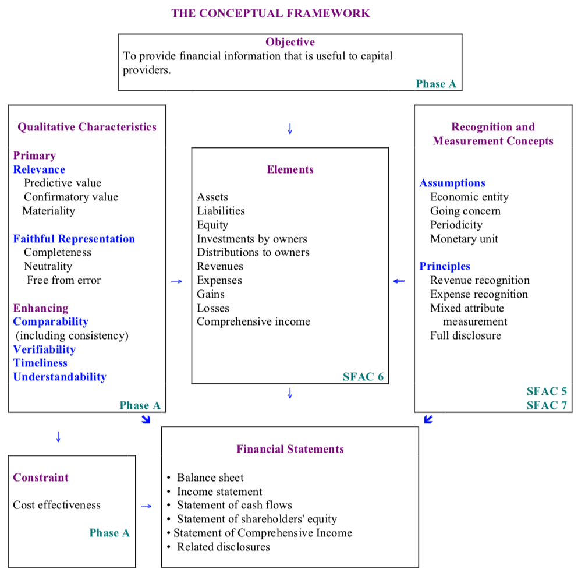
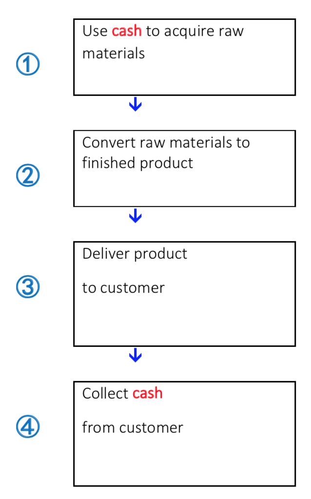
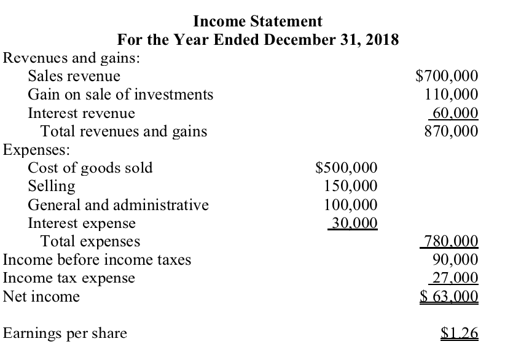
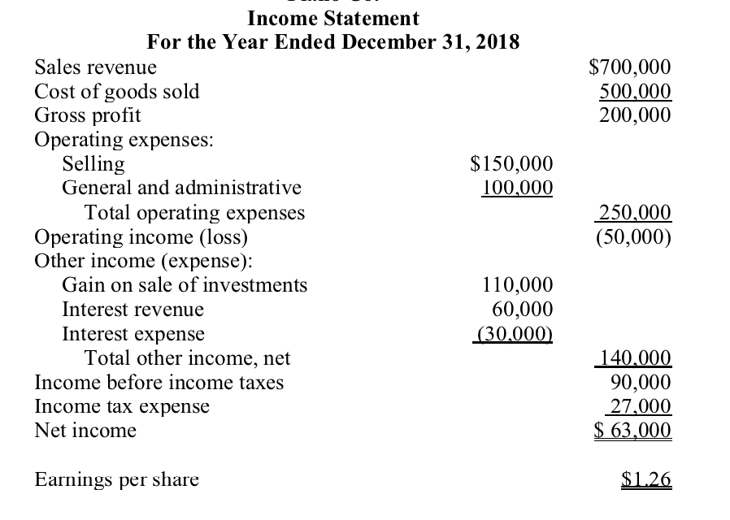

> Yes, Kelechi, that will be okay for you. Make sure you understand how the accounting system works and what information the financial statements convey. You also need to be familiar with key ratios such as those we use in our project.
>
> -Theo

# Cheat Sheet for Theo's list

## Ratios:

- liquidity ratios: useful for risk analysis. measures the ability to pay current obligations.
  - Working Capital (is a popular measure of a company's ability to satisfy it's short-term obligations)
    - = Current Assets - Current Liabilities

  - Current Ratio =  Current Assets / Current Liabilities

  - Acid-test ratio: A more precise ratio of working capital. This ratio excludes inventories and prepaid expenses from current assets.
    = Quick assets / Current liabilities

- Solvency Ratios: useful for risk analysis. ability to pay long term debits
  - Debt to equity  measures reliance on creditors, rather than owners
    = Total Liabilities / Shareholders' equity

  - Times interest earned indicates margin of safety provided to creditors
    = (Net income + interest expense + taxes) / interest expense

  - favorable financial leverage means earning a return on borrowed funds that exceeds the cost of borrowing the funds.

- Activity ratios: measure a company's efficiency in managing its Assets
  - asset turnover ratio measures a company's efficiency in using assets to generate revenue
    = net sales/ average total Assets

  - receivables turnover ratio offers and indication of how quickly a company is able to collect its accounts receivable.
    = net credit sales / average net accounts receivable

  - inventory turnover ratio measures a company's efficiency in managing its investment in inventory
    = cost of goods sold / average inventory balance

- Profitability Ratios: assist in evaluating various aspects of a company's profit making activities.

  - profit margin on sales: measures the amount of net income achieved per sales
    = net income / net sales

  - Return on assets indicates a company's overall profitability
    = profit margin on sales * asset turnover
    = (net income / net sales) * (net sales / average total assets)
    = net income / average total assets

  - Return on shareholders' equity (ROE) measures the return to suppliers of equity capital.
    = Net income / Average shareholders' equity

**Additional Ratios used in the project with Theo and Vic:**    

- Earnings to price ratio: earnings per share / price per share. metric for evaluating the relative attractiveness of a company's stock price compared to the current earnings of a firm.
- Book to market ratio: book value of equity / shares outstanding times closing price. The book-to-market ratio attempts to identify undervalued or overvalued securities by taking the book value and dividing it by market value. It helps to determine the market value of a company relative to its actual worth. Investors and analysts use this comparison ratio to differentiate between the true value of a publicly traded company and investor speculation. In basic terms, if the ratio is above 1 then the stock is undervalued; if it is less than 1, the stock is overvalued. A ratio above 1 indicates that the stock price of a company is trading for less than the worth of its assets.
- Return on Net Operating Assets: RNOA is similar to ROA except it is comprised of only operating activities. Financial analysts created the RNOA variation to hone in on operating activities. RNOA = net operating profit after tax / net operating assets.

## ACCY 301 Notes

### Day 1 & 2 Notes  [Environment and Theoretical structure of financial accounting]

##### Economic theory of information
- The economic goal of a society is to maximize wealth.

  - For that to happen, resources (e.g. labor, capital, natural resources) must be allocated efficiently (allocated to private enterprises that will use them best to provide the goods and services desired by society, and not to enterprises that will waste them): allocation efficiency.

- The capital markets provide a mechanism (supply and demand) to help our economy allocate resources efficiently.
  - examples of capital markets: Stock market; bond markets; etc.

- Markets need information to function and allocate resources.
  - Markets need macroeconomic information: interest rates, exchange rates, GDP growth, employment
  - industry specific information: number of firms, industry leadership, level of competition
  - firm-specific information: financial condition, revenue growth, profitability. **Finanical account provides the firm-specific information.**

##### The Economic Environment and Finanical Reporting

- Capital is wealth in the form of money or other assets.

- Firms acquire capital from investors in exchange for ownership interest and by borrowing from creditors (loans & bonds).

- A firm can provide a positive return to investors if the entity can generate enough cash receipts from selling a product or service that exceed the cash disbursements necessary to provide that product or service.

- The primary objective of financial accounting is to provide information to investors and creditors to help them predict future cash flows.

- The information provided through financial accounting is conveyed through:

  - Balance Sheet or statement of financial position:  The broad usefulness of the balance sheet is to indicate how the assets of the firm were financed.

  - Income statement or statement of operations: The broad usefulness of the income statement is to indicate the Value Added by the operating activities of the firm over  specific period.

  - Statement of cash flows:  The purpose of the statement of cash flows (SCF) is to provide information about cash receipts and cash disbursements that occurred during a period (it reports flows of value). A SCF is presented for each period in which results of operations are provided.

  - Statement of shareholders' equity:  The statement of shareholders' equity is a financial document a company issues as part of its balance sheet. It highlights the changes in value to stockholders' or shareholders' equity, or ownership interest in a company, from the beginning of a given accounting period to the end of that period.

  - Either:

    - Statement of other comprehensive income:  immediately following the income statement

    - Statement of comprehensive income including info on the income statement as well as on the statement of other comprehensive income

    - Comprehensive income is the total change in equity for a reporting period other than that from transactions with owners.

##### Cash versus accrual accounting

- Over short periods of time, recording only cash flow is not accurate. The accrual accounting model records both cash flows and accruals and provides a measure of periodic performance called **net income**.

- **net income is a product of using accrual accounting. net income =  income -  Cost of Goods Sold (COGS) - expenses - taxes

- **current net operating cash flows** is a product from cash accounting

- Net income is considered a better indicator of future operating cash flows than current net operating cash flows.

##### Why is accounting regulated

- When companies use the same rules to do the accounting, the users of the financial statements can compare financial information over time for a company and among companies.

##### The Conceptual Framework

- The purpose of the conceptual framework is to provide an underlying foundation for accounting standards.

- Conceptual Framework: 

- Recall the objective is to provide financial info that is useful to people who provide capital.

- Qualitative Characteristics of accounting information:
  - **Relevance:** Should be relevant such that the elements have predictive value; can be confirmed  and they are material (or note-worthy). i.e a piece of information about $5 revenue is not material for a company like apple.

  - **Faithful Representation:** The info provided is complete. This is necessary for faithful representation. Accounting standards used should be set with overall societal goals and specific objectives in mind, and should try not to favor particular groups or companies. Should be free from error. Verification should be required of the information. i.e greater verification before recognizing good news than bad news

  - **Enhancing:** The info provided should help users of the info see the similarities and diffs among events and conditions. Users must be able to understand the information.

  - **KEY CONSTAINT:** cost effectiveness. The benefit of the information provided must exceed the costs of producing the information

- Recognition and Measurement Concepts:
  - Assumptions:
    - Economic Entity Assumption: All economic events can be identified with a particular economic entity

    - Going Concern Assumption: In the absence of information to the contrary, it is anticipated that a business entity will continue to operate indefinitely.

    - Periodicity Assumption: The life of a company can be divided into artificial time periods to provide timely information to external Users.

    - Monetary Unity Assumption: Financial statement elements should be measured in terms of the USD.

  - Principles:
    - Revenue recognition: revenue is recognized when the seller transfers goods and services to customers but does not allow revenue recognition if it is not probable that the seller will receive the cash it is entitled to receive.

    - Expense recognition: typically occurs in the period in which expenses are incurred to produce revenue.
      - Matching Principle requires first recognizing revenue and then recognizing all expenses that were incurred to generate that revenue.

    - Measurement - associating numerical amount to assets, liabilities, equity.
      - There are 5 measurements:
        - Historical Cost: amount given or received in the original exchange transactions
        - Net realizable value: amount of cash into which the asset or liability will be converted in the ordinary course of business
        -  Current cost: the cost that would be incurred to purchase or reproduce an assets- resent value: future cash flows discounted for the time value of Monetary
        - Fair value: the price that would be received to sell assets or transfer liabilities in an orderly market transaction.

    - Disclosure -  financial reports should include any info that could affect the decisions made by external users, subject to of course the cost effectiveness constraint.

- elements (I find Theo's definitions a bit difficult to remember so I paraphrase the following or use alternative definitions):

  - Assets: An entity's resources i.e things a company owns.
  - liabilities: An entity's obligations. i.e the amounts the company owes.
  - Equity: an ownership interest in a business,
  - Investments by owners: Increases in equity of a particular business enterprise
  - Distribution to owners: Decrease in equity of a particular enterprise resulting from transfers to owners
  - Comprehensive income: The change in equity during a period from transactions and other events  from nonowner sources.
  - Revenues: Inflows, increases  in assets, or settlements of liabilities.
  - Expenses: Outflows, decreases in assets, or incurrences of liabilities.
  - Gains: Increases in Equity
  - Losses: Decreases in Equity

### Day 3 Notes: [Review of the accounting process]

##### The Accounting processing cycle

1. Obtain info about transactions from source documents (receipts, notes, etc.)

2. Perform transaction analysis where you review the source documents from Step 1 and determine the economic implications of the transactions

3. Record the transaction in a journal using a journal entry where debits will always equal credits.
  - a journal is a chronological list of transactions in debit/credit form.

4. You then post from the journal to the general ledger accounts.
  -  A general ledger contains a complete record of all the financial transactions of your company throughout its life.

5. Prepare an unadjusted trial balance.
  - An unadjusted trail balance is the listing of general ledger account balances at the end of a reporting period, before any adjusting entries are made to the balances to create financial statements

6. Record the adjusting entries and add those changes tp the ledger accounts

7. Prepare an adjusted trail balance

8. Prepare financial statements
  - i.e: balance sheet, income statement, statement of comprehensive income, statement of cash flows, and statement other comprehensive Income

9. Close the temporary accounts (all income statement accounts)

10. Prepare a post-closing trail balance.

- Accounting Equation: Assets = Liabilities + Shareholder's Equity

  - Shareholders Equity = Paid-in Capital + Retained Earnings
    - Revenues & Gains increase Retained Earnings
    - Expenses, Losses, & Dividends decrease retained earnings.

- Prepaid expenses represent assets recorded when a cash disbursement creates benefits beyond the current reporting periods

- Deferred revenues represent liabilities recorded when cash is received from customers before the entity provides them with goods or services.

- Accruals involve transactions where the cash outflow or inflow takes place in a period subsequent to expense or revenue recognition.

- Accrued liabilities represent liabilities that are recorded when an expense has been incurred prior to making a cash payment. For example: An entity has to pay it's employees

- Accrued receivables is the opposite of accrued liabilities. It involves situations when the revenue is recognized in a period prior being paid.

- Estimates are other made to comply with the accrual accounting model.

### Day 4 [The balance sheet and financial disclosures]

##### The balance sheet (statement of financial position):

- Usefulness: The broad usefulness of the balance sheet is to indicate how the assets of the firm were financed (assets = liabilities + equity).
  - It provides information useful for assessing future cash flows, liquidity, and long-term solvency.

- Limitations: Assets minus liabilities is not likely to represent the market value of the entity (number of common stock shares outstanding multiplied by price per share)

The operating cycle for a typical manufacturing plant:

- Assets can be either:
  - Current Assets: Include cash and all other assets expected to become cash or consumed within 1 year or the operating cycle.
  - Examples:
    - Cash (Bank drafts, Cashier's checks, Money Orders)
    - CASH EQUIVALENTS: TREASURY BILLS (U.S. GOVERNMENT OBLIGATIONS having 91-182 day maturities), COMMERICAL PAPER (short term notes 20 to 270 days), MONEY MARKET FUNDS (Variation of the mutual fund), MONEY MARKET SAVING CERTIFICATES (Issued by banks or savings and loans institutions)

  - Noncurrent Assets: Include cash and all other assets expected to become cash or consumed after 1 year or the operating cycle.
    - Property Plant and equipment: Tangible, long-lived assets used in the operations of the business. (i.e land, buildings, equipment, machinery, furniture)
    - Investments: Assets not used directly in the operations of the business (noncurrent receivables, cash set aside for special purposes)
    - Intangible Assets: Something without physical existence and represent exclusive rights to a product, process, (i.e:  patents, copyrights, franchises, goodwill)
    - Other Assets: catch-all classification that includes long-term prepaid expenses, called deferred charges, and any noncurrent asset not falling in one of the other classifications

- Tidbits about Assets:
  - If the cash in a checking acc is not enough to pay for an obligation, the bank provides the difference. Bank overdrafts are usually reported as a liability.
  - Short-term investments are classified as current  if the company management intends to liquidate the investment in the next year or operating cycle.
  - Accounts receivable arise from the sale of foods or services on credit.
  - Inventories consist of assets that a retail or wholesale company acquires for resale or goods that manufacturers produce for resale
  - Prepaid expenses arise when a cash payment creates benefits beyond the current period

- Liabilities can be either:
  - Current Liabilities: those obligations that are expected to be satisfied within 1 year or the operating cycle, whichever is longer.

    - Accounts payable: Obligations to suppliers of merchandise or services purchased on open accounts. Payments are usually due in 30-60 days.

    - Notes payable: Written promises to pay cash at some future date.

    - Deferred Revenues: Represent cash received from a customer for goods or services to be provided in a future period.

    - Accrued liabilities: Obligations created when expenses have been incurred but won't be paid until a subsequent reporting period

    - Current maturities of Long-Term Debt

  - Non-Current Liabilities: those obligations that are expected to be satisfied after 1 year
    - Shareholders' equity is comprised of paid-in (invested) capital and retained earnings
      - Paid-in capital: Amounts invested by Shareholders
      - Retained earnings: accumulated net income reported since the inception of the company and not yet paid to shareholders

### Day 5

- The broad usefulness of the income statement is to indicate the value added by operating activities of a firm over a specific period.

- The income statement reports flows of values.

- The balance statement reports stocks of values

- Income from continuing Operations includes revenues, expenses, gains, and losses that will most likely continue in future periods

- Revenues are inflows of resources resulting from providing goods or services to customers.

- Expenses are outflows of resources incurred while generating revenue.

- Gains or Losses are increases or decreases in equity.

- Operating income includes revenue and expenses directly related to the primary revenue-generating activities of the company.

- Non Operating income relates to peripheral or incidentals activities of the company.

- Income tax expense is shown as a separate expense.

- A single-step income statement format groups all revenues and gains together and all expenses and losses together

  - Example: 

- A Multiple-step income statement format includes a number of intermediate subtotals before arriving at income  from continuing operations:

  - Example: 

- In the US, the bottom line  of the income statement usually is called net income or net loss.

- Earnings Quality refers the ability of reported earnings to predict a company's future earnings.

- To enhance predictive value analysts try to separate a company's temp earnings from its permanent earnings.

  - Many believe that corporate earnings management practices reduce the quality of earnings. i.e smoothing accrual estimates & classification shifting.

- Not all items for the operating income should be considered indicative of a company's permanent earnings. i.e:
  - Restructuring costs include costs associated with shutdown or relocation of facilities or downsizing of operations.

  - Asset impairment losses, inventory write-down charges, losses from natural disasters

  - Earnings quality is affected by revenue issues as well

- Discontinued Operations involve the disposal or planned disposal of a component of an entity and must be reporting separately on the income statement

- Earnings per share (EPS) - is the amount of income reported during a period for each share of common stock outstanding.

- All corporations whose common stock is publicly traded must disclose EPS.

- Basic EPS = net income / weighted common shares outstanding

- Diluted EPS accounts for the dilution effect  in EPS if theres a increase in common shares outstanding

- Comprehensive income is the total change in equity for a reporting period other than that from transactions with owners.

- The statement of cash flows provides information about cash receipts and cash disbursements that occurred during a period. (flows of value)
